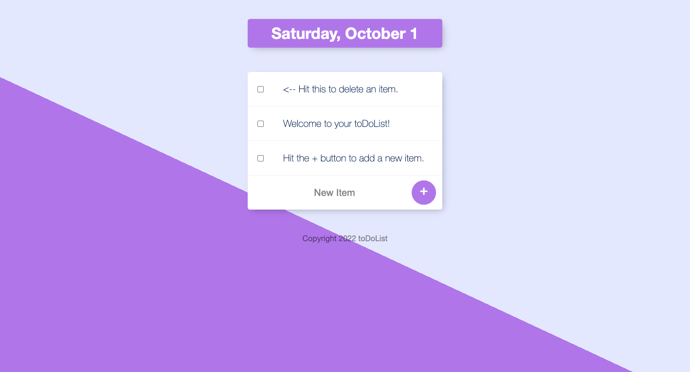

# ToDoList

## Table of contents

- [Overview](#overview)
  - [The challenge](#the-challenge)
  - [Screenshot](#screenshot)
  - [Links](#links)
- [My process](#my-process)
  - [Built with](#built-with)
  - [What I learned](#what-i-learned)
  - [Useful resources](#useful-resources)

## Overview

### The challenge

Users should be able to:

- Write a new item to the todo list and delete them after they are done or finished.
- Change the section of the website from the date to customize section by adding the name of the section at the end of the URL and it will create new section.
- Follow the date of the day from app.

### Screenshot

### Links

- Live Site URL: [ToDo List](https://to-do-list-v0.herokuapp.com/)

## My process

### Built with

- Semantic HTML5 markup
- CSS custom properties
- Node.js
- Express.js
- EJS
- Mongoose
- MongoDB
- Npm

- [Node.js](https://nodejs.org/en/) - To establish a server with JS
- [Express](https://expressjs.com/) - Web framework for Node.js
- [EJS](https://ejs.co/) - Embedded javaScript templating
- [MongoDB](https://mongoosejs.com/) - Database
- [Npm](https://www.npmjs.com/) - Npm packages 

### What I learned

- How to create a website with server and database using node.js for the server and express to handle the requests and the responses also to manage static files in public folder, and with EJS I was able to using javascript inside html files.
- And how to save the data in the database like mongodb, also implemented many packages so, I used npm to keep it simple, and efficient.

### Useful resources

- [Loadash](https://lodash.com/) - This helped me for managing the URL for lowercase and uppercase characters.

